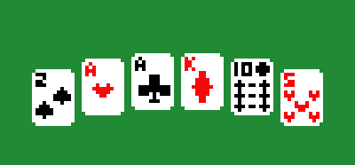

<div style="max-height: 300px; overflow: hidden; display: flex; justify-content: center; align-items: center;"></div>

# Multiplayer Blackjack

## Index

1. [About](#about)
2. [Documentation](#documentation)
   1. [Protocol](#protocol)
   2. [Server-side](#server-side)
   3. [Client-side](#client-side)
4. [How to run](#how-to-run)
5. [Team](#team)

## About

This is just a personal project to learn how to use Websockets and make multiplayer games.

It uses the [`ws` library](https://www.npmjs.com/package/ws) from Node

## Documentation

### Protocol

Example message:

```
{
  type: "exampleProtocol",
  data: { test: true },
}
```

### Server-side

- `createPlayer`
- `getGamelist`
- `hostGame`
- `startGame`

### Client-side

## How to run

Clone this repository, then open a terminal in the root folder

Run **`npm install`** and then **`npm run start`**

Your server should now be running and you can test it by trying to connect to it by running **`let server = new WebSocket("ws://localhost:3000")`** in the **dev tools terminal** inside your browser.
Or you could run **`node test.js`** in another terminal also in the root folder.

## Team
